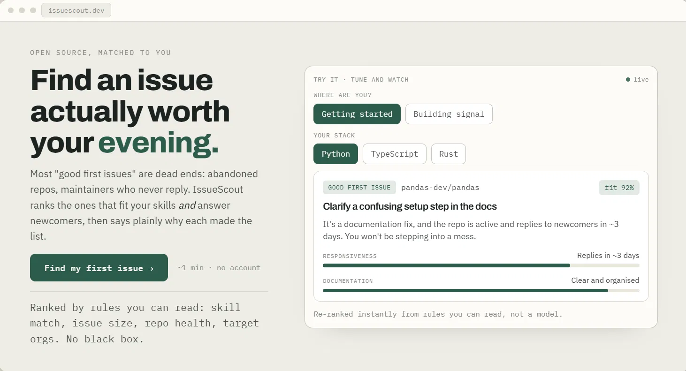
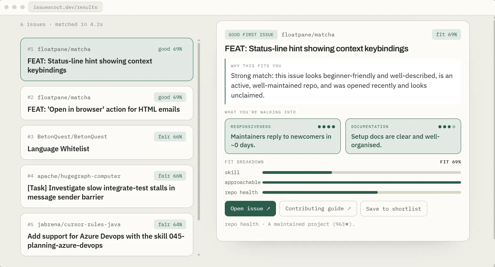
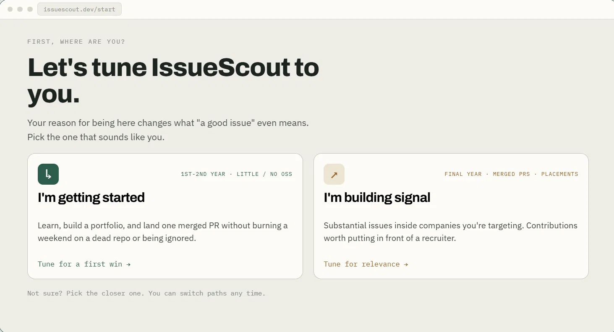
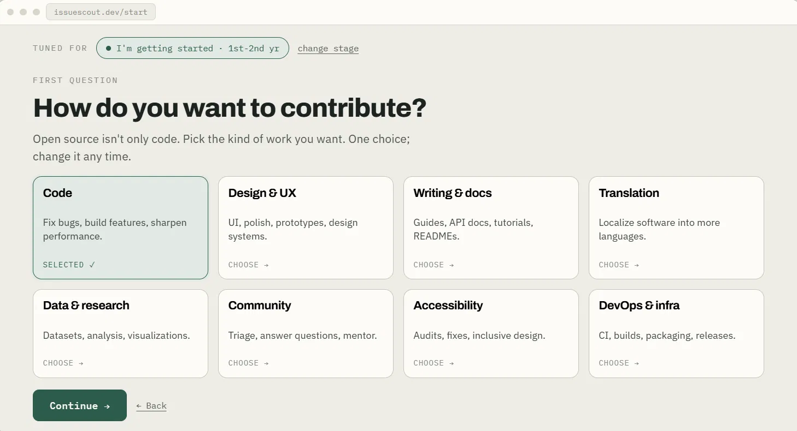
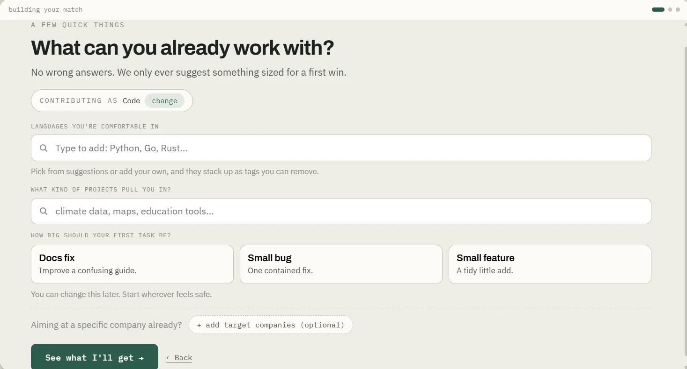

# IssueScout

**A field guide to open source.** IssueScout finds open-source issues actually worth your time and ranks them by rules you can read, not a black box.

🔗 **Live:** [issuescout.onrender.com](https://issuescout.onrender.com)



> Note: the live demo runs on a free tier and sleeps when idle, so the first request after a while takes a few seconds to wake up.

---

## The problem

Most "good first issue" lists are full of dead ends: abandoned repos, maintainers who never reply, and tasks that need a week of context before you can write a single line. Finding a contribution that actually fits your skills *and* answers newcomers is harder than it should be.

IssueScout pulls open, unassigned issues from GitHub in real time and ranks the ones that fit, then says plainly why each made the list.

---

## How it works

The defining design decision is where the intelligence lives.

**All scoring and ranking is deterministic Python.** Every issue is scored on factors you can read: how well it matches your languages, how healthy and active the repo is, how fast maintainers reply to newcomers, the size and approachability of the task, and whether it sits inside a company you are targeting. The ranking is fully explainable and reproducible, never decided by a model.

**The language model is confined to a narrow, optional role.** It does two things only: parse free-text interests into structured filters, and narrate an already-computed explanation in plain language. It never touches the ranking. If no model is configured or reachable, the app falls back to templated explanations and keeps working exactly the same. The LLM backend is swappable by a single environment variable (local Ollama for development, Google Gemini for production).

This separation means IssueScout behaves identically with or without a model behind it. The model is an enhancement, never a dependency.

---

## What a match looks like

Each ranked issue comes with everything you need to decide in one glance: a fit score and label (strong / good / fair) derived from the deterministic factors, a plain-language reason citing only the factors that actually scored, responsiveness and documentation signals so you know how fast maintainers reply and whether the docs will leave you stranded, a fit breakdown showing skill, approachability, and repo-health contributions as readable bars, and repo health at a glance with direct links to the issue and the contributing guide.

The result is not "here are some issues." It is "here is why this specific issue is worth your evening, and what you are walking into."



---

## Features

**Two paths, tuned to where you are.** "Getting started" steers toward small, well-scoped issues in responsive repos so you can land a first merged PR. "Building signal" steers toward substantial work inside the companies you are targeting.



**Eight contribution paths, not just code.** Design, docs, translation, data, community, accessibility, and DevOps each get path-appropriate profile questions and interest suggestions, so a designer is never asked which ML framework they use.



**A profile sized for a first win.** Languages, interests, and task size are collected with sensible defaults, and target companies are optional, so the form adapts to the path you picked rather than asking everyone the same thing.



Plus, under the surface:

- **Real-time GitHub search** across three sources: target-company orgs, language-matched issues, and topic-driven repositories, deduplicated and merged into one ranked pool.
- **Readable explanations.** Every match shows the factors that earned its rank, with responsiveness, documentation, and repo-health signals surfaced up front.
- **Repository quality floor** that filters out abandoned and low-reputation repos by star count, scaled to your level.
- **Graceful degradation** under GitHub rate limits and when no LLM is available.

---

## Tech stack

- **Backend:** Python 3, standard-library HTTP server (no web framework)
- **Data:** GitHub REST & GraphQL APIs
- **LLM:** swappable backend, local Ollama (dev) / Google Gemini (production), selected by `LLM_BACKEND`
- **Frontend:** single-file vanilla HTML/CSS/JS, no build step
- **Deploy:** Render

---

## Running locally

You need Python 3 and a GitHub personal access token (a classic token with public repo read scope is enough).

1. **Clone and install dependencies**
   ```bash
   git clone https://github.com/yvssshubam/issueScout.git
   cd issueScout
   pip install -r requirements.txt
   ```

2. **Configure environment**

   Copy the example file and fill in your values:
   ```bash
   cp env.example env.issuescout
   ```

   Then edit `env.issuescout`:
   ```
   GITHUB_TOKEN=your_github_token_here
   LLM_BACKEND=gemini
   GEMINI_API_KEY=your_gemini_key_here
   GEMINI_MODEL=gemini-2.5-flash
   ```

   To run without a hosted model, set `LLM_BACKEND=ollama` (with Ollama running locally) or leave it unset to use templated explanations only. `env.issuescout` is gitignored and never committed.

3. **Start the server**
   ```bash
   python server.py
   ```

   Open [http://localhost:8000](http://localhost:8000).

---

## Architecture

The pipeline is deliberately split so each stage is independently testable:

| File | Responsibility |
|------|----------------|
| `server.py` | HTTP server, request guards (per-IP rate limit, body cap, input sanitization), onboarding answers to profile mapping |
| `pipeline.py` | Orchestrates collection, enrichment, ranking, and the repo quality floor |
| `github_client.py` | All GitHub API access: search, per-repo fetches, rate-limit handling, caching |
| `scorer.py` | Deterministic scoring and ranking |
| `repo_health.py` | Per-repo health and maintainer-responsiveness signals |
| `career_map.py` | Resolves target companies to GitHub orgs |
| `llm.py` | The only place a language model is used: interest parsing and explanation narration, with templated fallback |
| `web/index.html` | Single-file frontend |

Design notes worth calling out: target-org searches run first so they win the rate-limit race; per-repo issue fetches use the Core API (5,000/hour) rather than the Search API (30/minute); and the public server is hardened with per-IP rate limiting, a request-size cap, and input sanitization before anything reaches the pipeline.

---

## License

MIT